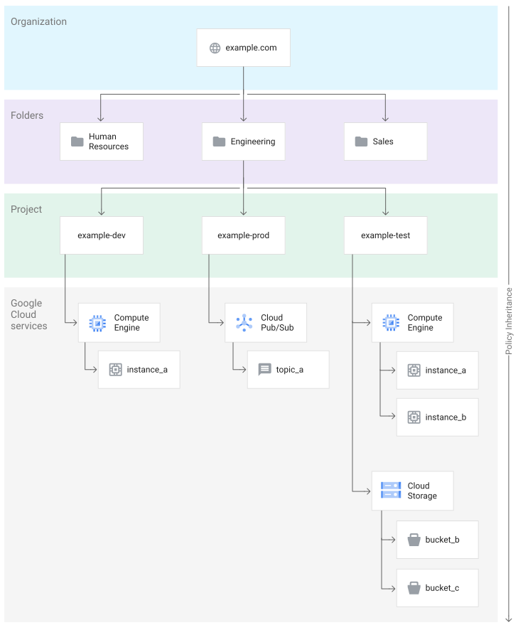
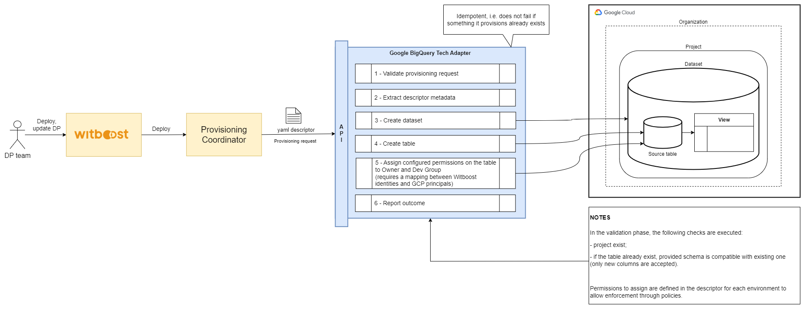
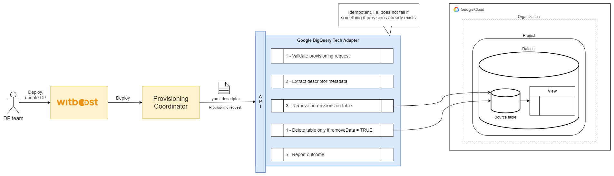
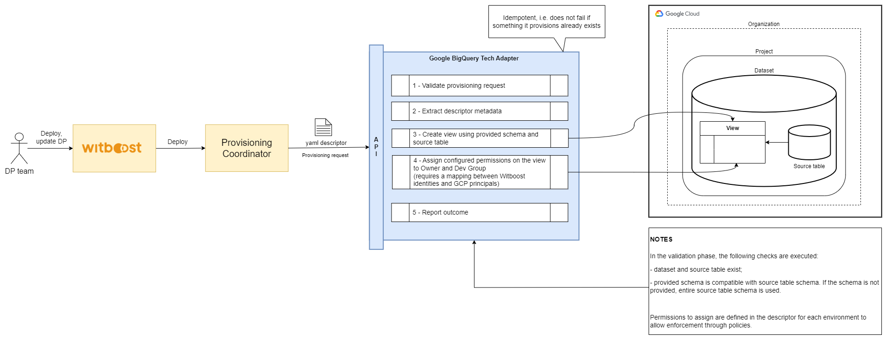
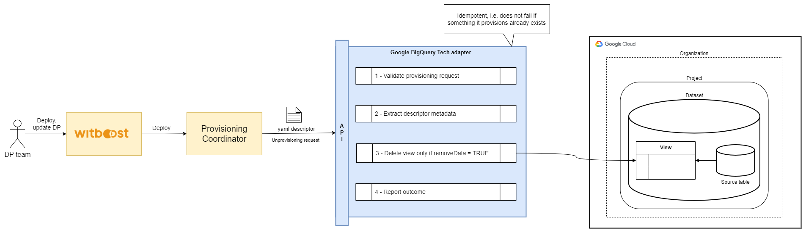
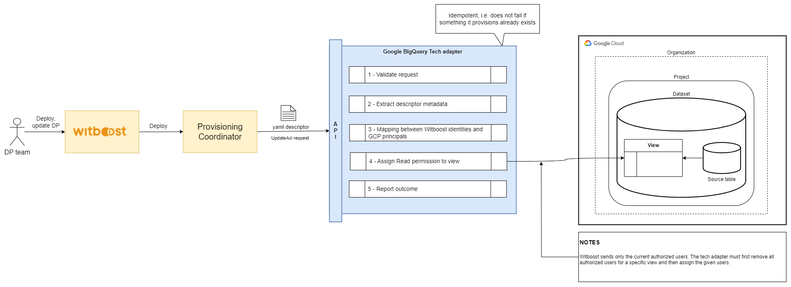

# High Level Design

This document describes the High Level Design of the Google BigQuery Tech Adapter.
The source diagrams can be found and edited in the [accompanying draw.io file](HLD.drawio).

- [Overview](#overview)
- [Storage Area](#storage-area)
- [Output Port](#output-port)

## Overview

### Tech Adapter

A Tech Adapter (TA) is a service in charge of performing a resource allocation task, usually
through a Cloud Provider. The resources to allocate are typically referred to as the _Component_, the
details of which are described in a YAML file, known as _Component Descriptor_.

The TA is invoked by an upstream service of the Witboost platform, namely the Coordinator, which is in charge of orchestrating the creation
of a complex infrastructure by coordinating several TAs in a single workflow. The TA receives
the _Data Product Descriptor_ as input with all the components (because it might need more context) plus the id of the component to provision, named _componentIdToProvision_

To enable the above orchestration a TA exposes an API made up of five main operations:
- validate: checks if the provided component descriptor is valid and reports any errors
- provision: allocates resources based on the previously validated descriptor; clients either receive an immediate response (synchronous) or a token to monitor the provisioning process (asynchronous)
- status: for asynchronous provisioning, provides the current status of a provisioning request using the provided token
- unprovision: destroys the resources previously allocated.
- updateacl: grants access to a specific component/resource to a list of users/groups

### What is Google Cloud?

Google Cloud consists of a set of physical assets, such as computers and hard disk drives, and virtual resources, such as virtual machines (VMs), that are contained in data centers around the globe. Each data center location is in a region. Regions are available in Asia, Australia, Europe, Africa, the Middle East, North America, and South America. Each region is a collection of zones, which are isolated from each other within the region. Each zone is identified by a name that combines a letter identifier with the name of the region. For example, zone `a` in the East Asia region is named `asia-east1-a`.

This distribution of resources provides several benefits, including redundancy in case of failure and reduced latency by locating resources closer to clients. This distribution also introduces some rules about how resources can be used together.

Google Cloud has container resources, such as projects, folders, and organizations, that let you organize your resources in a parent-child hierarchy. This hierarchy is called the resource hierarchy:
- The _organization_ is the root node in the hierarchy.
- _Folders_ are children of the organization, or of another folder.
- _Projects_ are children of the organization, or of a folder.
- _Resources_ for each service are descendants of projects.

### Projects
Any Google Cloud resources that you allocate and use must belong to a project. You can think of a project as the organizing entity for what you're building. A project is made up of the settings, permissions, and other metadata that describe your applications. Resources within a single project can work together easily, for example by communicating through an internal network, subject to the regions-and-zones rules. A project can't access another project's resources unless you use Shared VPC or VPC Network Peering.

Each Google Cloud project has the following:

- A project name, which you provide (e.g. Example Project)
- A project ID, which you can provide or Google Cloud can provide for you (e.g. example-id)
- A project number, which Google Cloud provides (e.g. 123456789012)

Each project ID is unique across Google Cloud. After you have created a project, you can delete the project but its ID can never be used again.

### What is Google BigQuery?

BigQuery is a fully managed, AI-ready data platform that helps you manage and analyze your data with built-in features like machine learning, search, geospatial analysis, and business intelligence. BigQuery's serverless architecture lets you use languages like SQL and Python to answer your organization's biggest questions with zero infrastructure management.

BigQuery provides a uniform way to work with both structured and unstructured data and supports open table formats like Apache Iceberg, Delta, and Hudi. BigQuery streaming supports continuous data ingestion and analysis while BigQuery's scalable, distributed analysis engine lets you query terabytes in seconds and petabytes in minutes.

BigQuery's architecture consists of two parts: a storage layer that ingests, stores, and optimizes data and a compute layer that provides analytics capabilities. These compute and storage layers efficiently operate independently of each other thanks to Google's petabit-scale network that enables the necessary communication between them.

BigQuery interfaces include Google Cloud console interface and the BigQuery command-line tool. Developers and data scientists can use client libraries with familiar programming including Python, Java, JavaScript, and Go, as well as BigQuery's REST API and RPC API to transform and manage data. ODBC and JDBC drivers provide interaction with existing applications including third-party tools and utilities.

#### Datasets

A dataset is contained within a specific project. Datasets are top-level containers that are used to organize and control access to tables and views.

#### Tables

A BigQuery table contains individual records organized in rows. Each record is composed of columns (also called fields).

Every table is defined by a _schema_ that describes the column names, data types, and other information. You can specify the schema of a table when it is created, or you can create a table without a schema and declare the schema in the query job or load job that first populates it with data.

Use the format `projectname.datasetname.tablename` to fully qualify a table name when using GoogleSQL.

#### Logical views

A view is a virtual table defined by a SQL query. The default type of view for BigQuery is a _logical view_. Query results contain only the data from the tables and fields specified in the query that defines the view.

The query that defines a view is run each time the view is queried.

### IAM

A role is a collection of permissions. You can use the following types of roles in IAM to provide access to BigQuery resources:
- Predefined roles are managed by Google Cloud and support common use cases and access control patterns.
- Custom roles provide access according to a user-specified list of permissions.

#### IAM roles in BigQuery

Permissions are not assigned directly to users, groups, or service accounts. Instead, users, groups, or service accounts are granted access to one or more predefined or custom roles to give them permissions to perform actions on resources.

You can grant access at the following BigQuery resource levels:
- Organizations, folders, or projects
- Connections
- Datasets
- Tables or views
- Policy tags, row access policies, or BigQuery data policies

#### Principal identifiers

When you refer to a principal in an Identity and Access Management (IAM) policy, you need to use the correct identifier for the principal. The format of the identifier depends on the type of principal you want to refer to and the type of policy you're writing.

| Principal type  | Identifier                                                                                                     |
|-----------------|----------------------------------------------------------------------------------------------------------------|
| User            | user:USER_EMAIL_ADDRES. Example: user:alex@example.com                                                         |
| Service account | serviceAccount:SA_EMAIL_ADDRESS. Example: serviceAccount:my-service-account@my-project.iam.gserviceaccount.com |
| Group           | group:GROUP_EMAIL_ADDRESS. Example: group:my-group@example.com                                                 |
| Domain          | domain:DOMAIN. Example: domain:example.com                                                                     |

### Google BigQuery Tech Adapter

The **Google BigQuery Tech Adapter** provides integration with BigQuery to manage views (along with schemas) and apply ACLs to them. It uses the [BigQuery client libraries](https://cloud.google.com/bigquery/docs/reference/libraries?hl=en).

It offers:
- **Table Management**: Create a table as a Storage Area component.
- **View Management**: Create a view to decouple underlying source table schema from the Output Port schema.
- **View Schema Management**: Columns need to be a subset (or the same) as underlying table
- **IAM Management**:
  - Assign configurable (per-environment) permissions on the table/view to Owner and Dev Group
  - Assign Read permission for whoever request access to the view.

## Storage Area

### Provisioning

### Unprovisioning

## Output Port

### Provisioning

### Unprovisioning

### Update ACL

